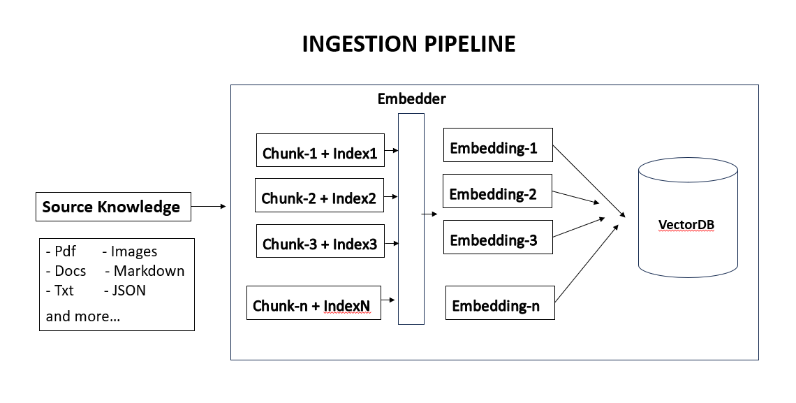
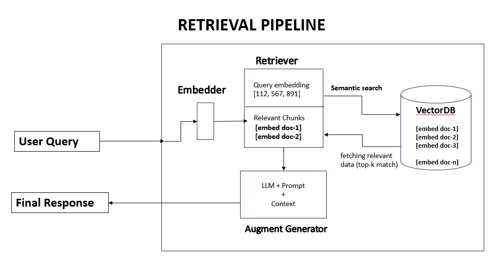

# Document RAG

A small Flask API for adding documents to Pinecone and asking questions about their content.

## Project structure

```text
document_rag/
├── app.py                  # Flask application entry point
├── config.py               # Model and RAG settings
├── requirements.txt        # Python dependencies
├── .sample-env             # Environment variable template
├── assets/                 # Architecture diagrams
├── data/documents/         # Uploaded documents
├── ingestion/              # Loading, chunking, embeddings, and storage
├── retrieval/              # Search and answer generation
└── routes/                 # HTTP API endpoints
```

## Prerequisites

- Python 3.10 or newer
- A Pinecone account, API key, and index configured for 512-dimensional vectors
- A Groq API key for generating answers

Create a `.env` file from `.sample-env` and fill in your credentials and Pinecone index name:

```env
GROQ_API_KEY=your_groq_api_key
PINECONE_API_KEY=your_pinecone_api_key
PINECONE_INDEX_NAME=your_pinecone_index
PINECONE_NAMESPACE=default
```

Keep `.env` private; do not commit API keys.

## Install and run

From the `document_rag` folder:

```bash
pip install -r requirements.txt
python app.py
```

The API listens at `http://localhost:5000`.

## Ingestion guide



1. **Source data:** Upload a PDF, TXT, DOCX, Markdown, or CSV file.
2. **Chunking:** The text is split into overlapping pieces (1,000 characters with 150 characters of overlap).
3. **Embedding model:** Pinecone's `llama-text-embed-v2` turns each piece into a vector.
4. **Embeddings:** Each vector represents the meaning of its text chunk. The document ID and source details are saved with it.
5. **Vector database:** Chunks and vectors are stored in the configured Pinecone index and namespace.

## Retrieval guide



1. **Query embedding:** The question is converted into a vector using the same embedding model.
2. **Semantic search:** Pinecone finds chunks with meanings closest to the question, limited to the requested document.
3. **Top-k chunks:** The three most relevant chunks are selected (`TOP_K=3` in `config.py`).
4. **Augment generator:** Those chunks are added to the prompt sent to the Groq language model, which generates an answer and source references.

## Test the API (Windows)

Start the app first. Run these commands from a separate terminal.

### Ask a question

```powershell
curl.exe -X POST "http://localhost:5000/api/rag/query" -H "Content-Type: application/json" -d "{\"question\":\"What is this document about?\",\"document_id\":\"doc_001\"}"
```

### Ingest a document

```powershell
curl.exe -X POST "http://localhost:5000/api/rag/documents" -F "file=@C:\Users\yuges\OneDrive\Desktop\AI_Engineering_0_1\document_rag\data\documents\test_doc.pdf" -F "document_id=doc_001"
```

### Update a document

```powershell
curl.exe -X PUT "http://localhost:5000/api/rag/documents/doc_001" -F "file=@data/documents/updated.pdf"
```

### Delete a document

```powershell
curl.exe -X DELETE "http://localhost:5000/api/rag/documents/doc_001"
```